# Generate Transparent Image

A Codex skill for creating straight-alpha PNG assets from text prompts or reference images.

It renders the subject over black and white in one generated master, aligns both copies, solves alpha locally, and validates the result on checker, black, white, green, and magenta backgrounds. Mixed assets can use a material-aware 2×2 master with separate opaque-core and soft-effect masks.

Status: `v0.2.1-beta`

## Install

```bash
git clone https://github.com/MangoWAY/generate-transparent-image.git
mkdir -p "${CODEX_HOME:-$HOME/.codex}/skills"
cp -R generate-transparent-image/generate-transparent-image \
  "${CODEX_HOME:-$HOME/.codex}/skills/"
```

The local recovery script requires Python 3, Pillow, and NumPy:

```bash
python3 -m pip install -r requirements.txt
```

## Use

Invoke the skill in Codex:

```text
Use $generate-transparent-image to create a transparent PNG of a realistic flame.
```

For a supplied image:

```text
Use $generate-transparent-image to remove the scene background. Keep the person,
hair detail, translucent fabric, and surrounding smoke.
```

Each run preserves the generated master, normalized prompt, alpha matte, checker preview, diagnostics, and final RGBA PNG under `output/transparent-image/<asset>/`.

## Recovery modes

| Mode | Master | Use for |
|---|---|---|
| Paired | black subject + white subject | fur, glass, water, smoke, fire, products |
| Material 2×2 | black + white + opaque-core mask + soft-effect mask | characters or products mixed with smoke, ink, glow, or sheer material |

The 2×2 mode forces only safe solid interiors to alpha 1. Soft-effect regions retain the alpha recovered from the black/white pair.

Recovery also removes faint panel frames and seam residue from the guaranteed blank outer margin. Use `--edge-cleanup aggressive` only when a visible edge line survives the default automatic pass.

## Examples

### Realistic cat

Input: `A cute, photorealistic young orange tabby cat sitting upright...`

[Full prompt](docs/examples/cat/prompt.txt)

| Generated master | Checker preview | Transparent PNG |
|---|---|---|
|  | 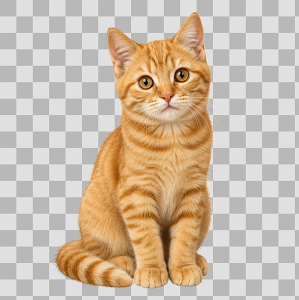 | [](docs/examples/cat/transparent.png) |

### Flame

Input: `A single isolated burning flame with a bright core, layered flame tips, heat shimmer, and embers...`

[Full prompt](docs/examples/flame/prompt.txt)

| Generated master | Checker preview | Transparent PNG |
|---|---|---|
| 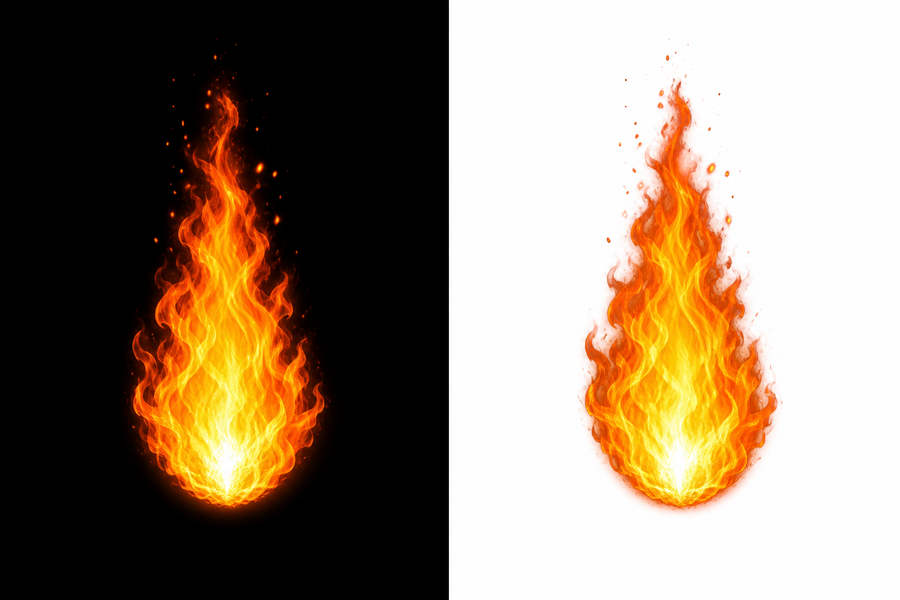 | 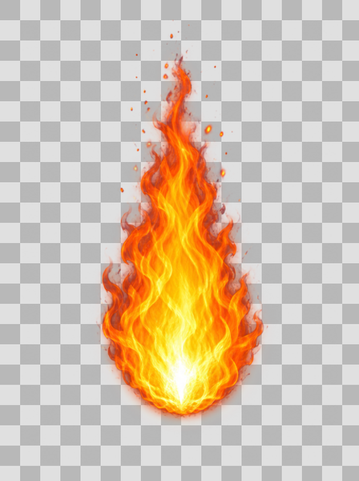 | [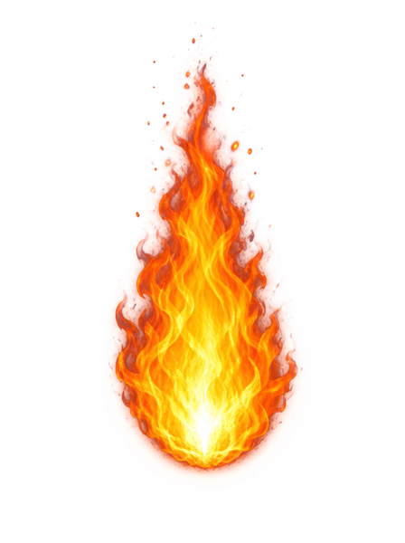](docs/examples/flame/transparent.png) |

### Glass potion bottle

Input: `A photorealistic transparent glass potion bottle filled with luminous blue liquid...`

[Full prompt](docs/examples/glass/prompt.txt)

| Generated master | Checker preview | Transparent PNG |
|---|---|---|
| 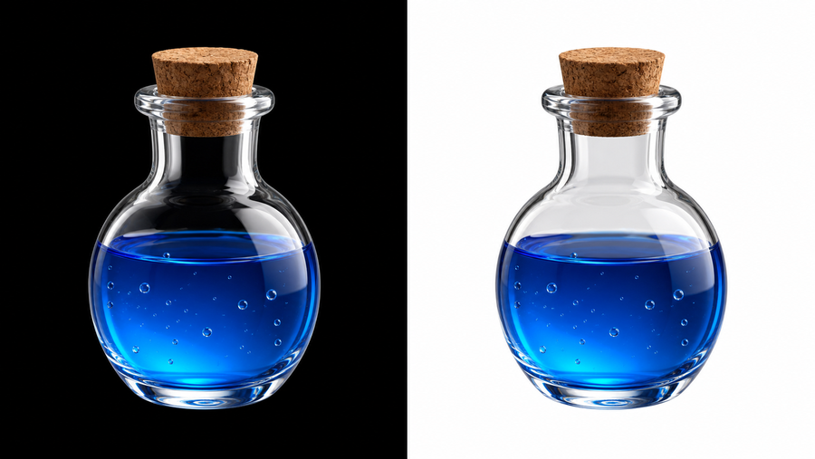 |  | [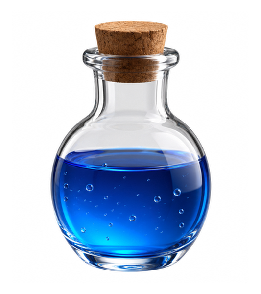](docs/examples/glass/transparent.png) |

### Blue-purple smoke

Input: `An isolated blue-and-purple smoke vortex with layered translucent curls...`

[Full prompt](docs/examples/smoke/prompt.txt)

| Generated master | Checker preview | Transparent PNG |
|---|---|---|
| 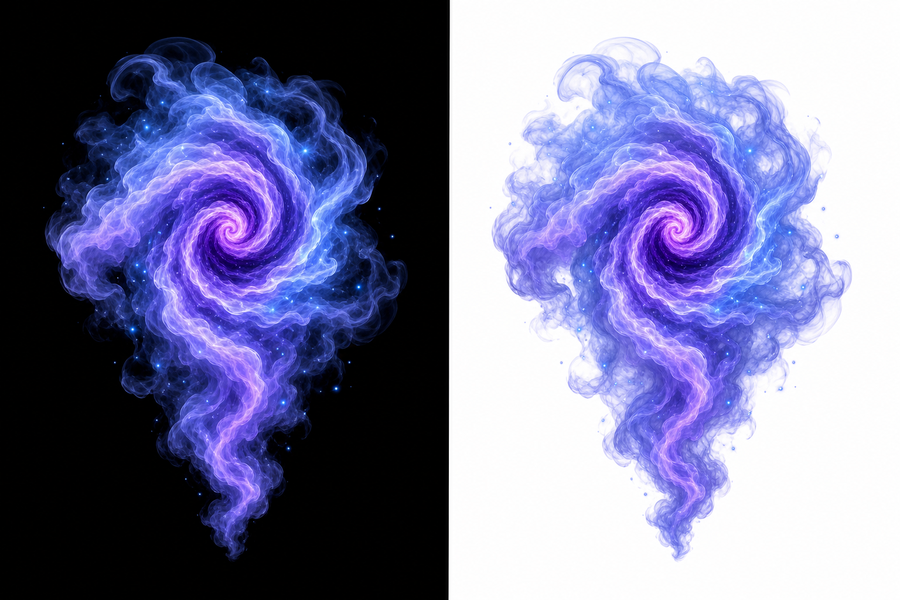 | 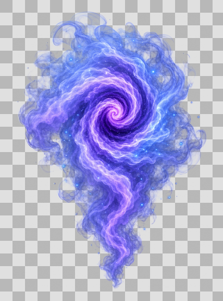 | [](docs/examples/smoke/transparent.png) |

### Character with translucent magic — material 2×2

Input: `An original storm sorceress with a solid costume and staff, surrounded by translucent blue-violet smoke...`

[Full prompt](docs/examples/sorceress/prompt.txt)

| 2×2 master | Opaque-core mask | Soft-effect mask |
|---|---|---|
| 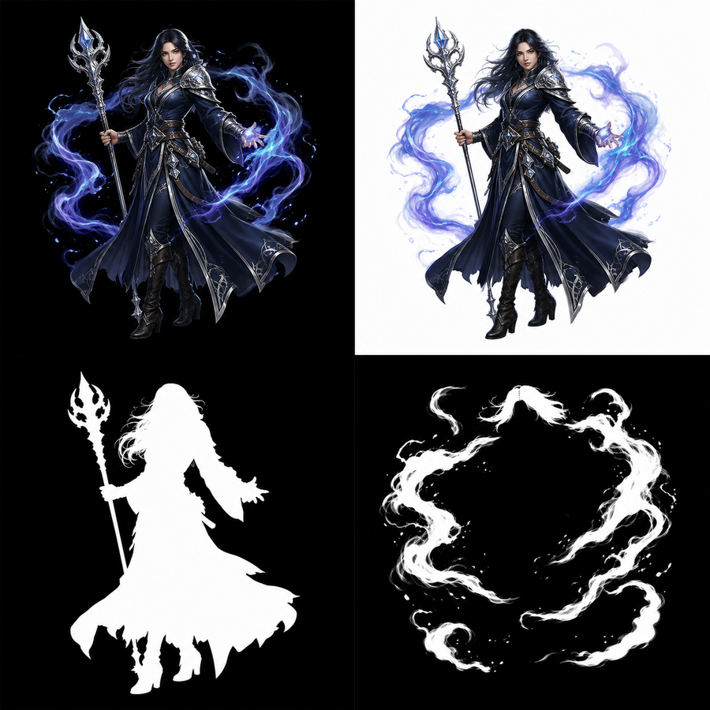 |  | 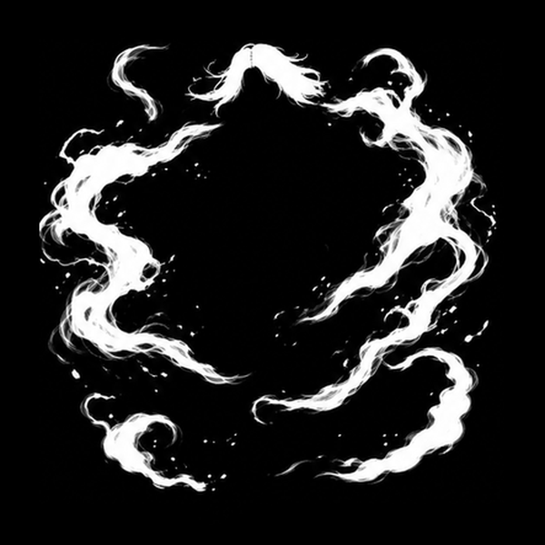 |

| Checker preview | Transparent PNG |
|---|---|
| 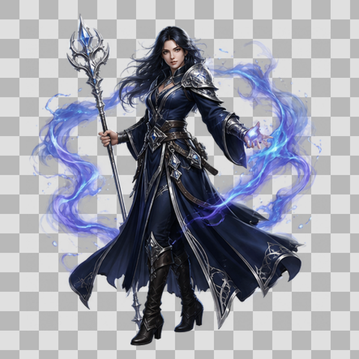 | [](docs/examples/sorceress/transparent.png) |

## Direct recovery

Paired master:

```bash
python3 generate-transparent-image/scripts/recover_alpha.py \
  --input source-pair.png \
  --output transparent.png \
  --alpha-out alpha.png \
  --preview-out preview.png \
  --preview-grid-out preview-grid.png \
  --report-out report.json \
  --strict
```

Material-aware 2×2 master:

```bash
python3 generate-transparent-image/scripts/recover_alpha.py \
  --layout material-2x2 \
  --input source-2x2.png \
  --output transparent.png \
  --alpha-out alpha.png \
  --soft-alpha-out soft-alpha.png \
  --core-mask-out opaque-core-mask.png \
  --soft-mask-out soft-effect-mask.png \
  --preview-out preview.png \
  --preview-grid-out preview-grid.png \
  --report-out report.json \
  --strict
```

## Test

```bash
python3 -m unittest discover -s generate-transparent-image/tests -v
```

The current suite covers paired recovery, material 2×2 recovery, opaque-core correction, soft-effect priority, mask registration, edge-frame cleanup, and CLI outputs.

## Limits

- Generated reference-image cutouts may redraw fine identity or costume details.
- A 2×2 master reduces the resolution available to each panel.
- Refraction and background-dependent reflections cannot be represented perfectly by fixed RGB plus scalar alpha.

## License

MIT
