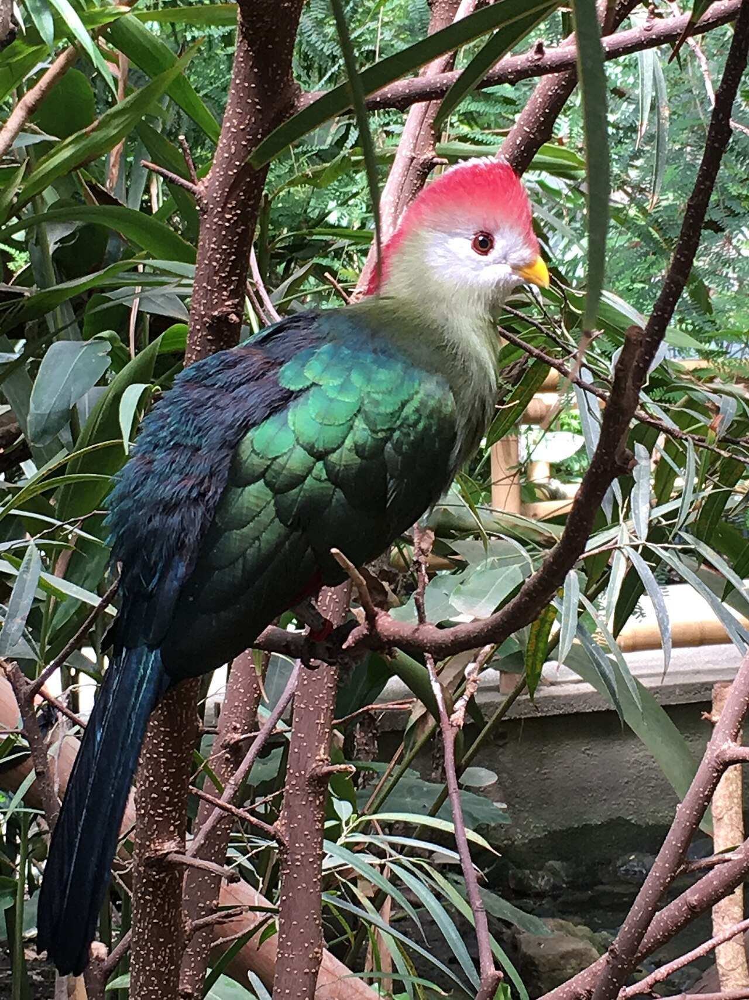
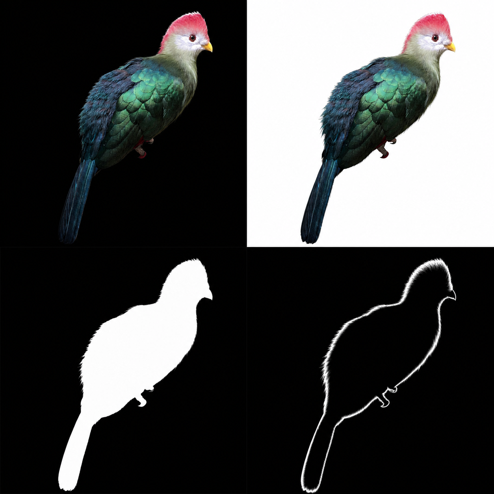
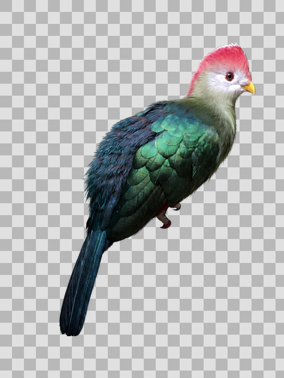
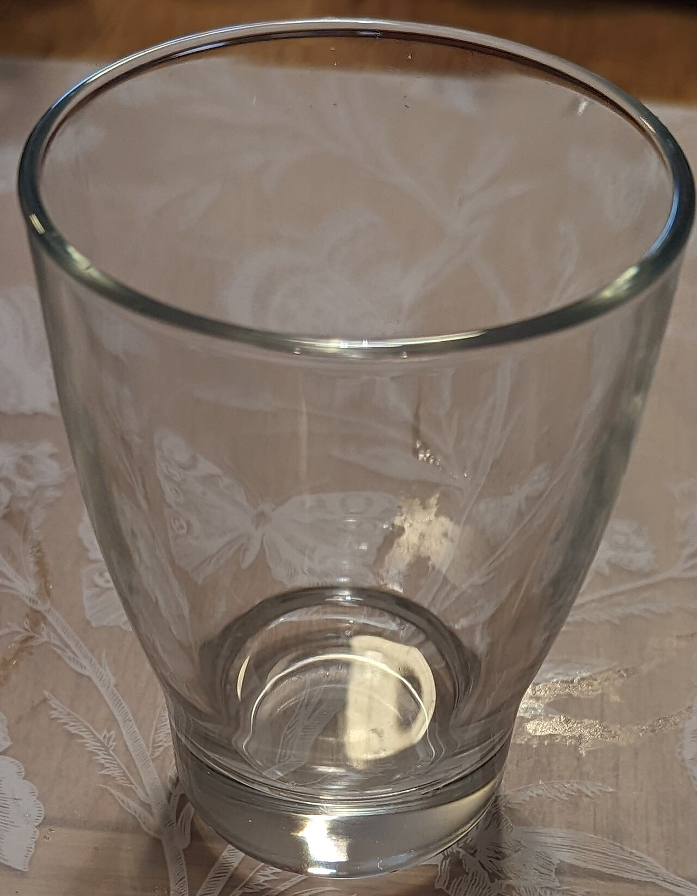
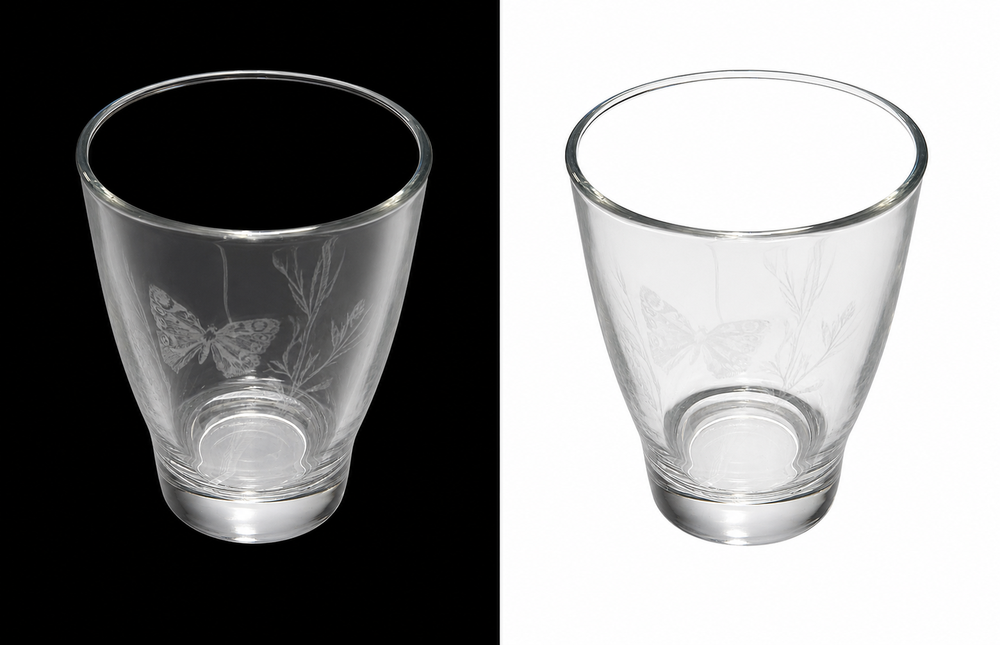
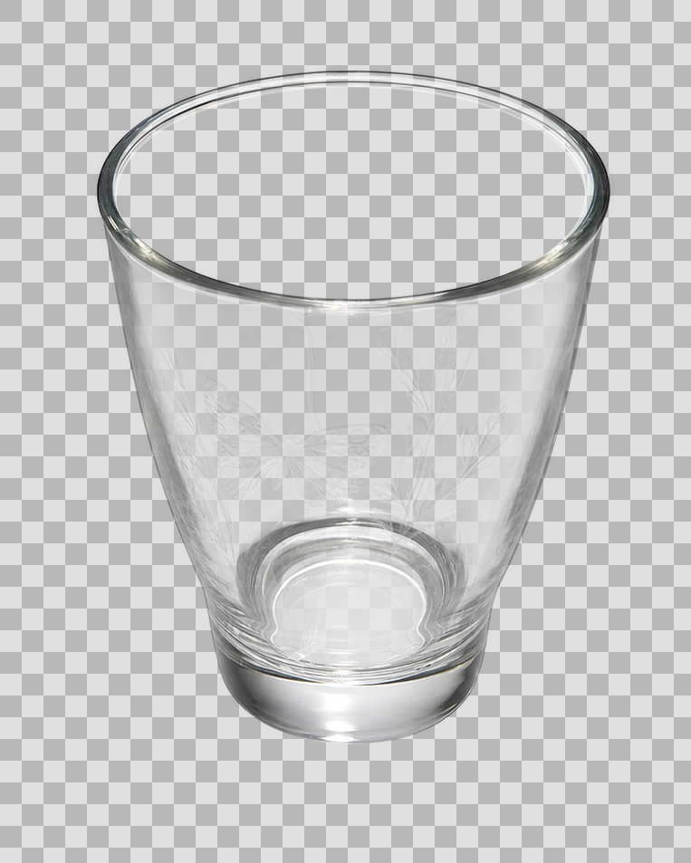

# Generate Transparent Image

A Codex skill for creating straight-alpha PNG assets from text prompts or reference images.

It renders the subject over black and white in one generated master, aligns both copies, solves alpha locally, and validates the result on checker, black, white, green, and magenta backgrounds. Mixed assets can use a material-aware 2×2 master with separate opaque-core and soft-effect masks.

Status: `v0.2.1-beta`

## Install

```bash
git clone https://github.com/MangoWAY/generate-transparent-image.git
mkdir -p "${CODEX_HOME:-$HOME/.codex}/skills"
cp -R generate-transparent-image/generate-transparent-image \
  "${CODEX_HOME:-$HOME/.codex}/skills/"
```

The local recovery script requires Python 3, Pillow, and NumPy:

```bash
python3 -m pip install -r requirements.txt
```

## Use

Invoke the skill in Codex:

```text
Use $generate-transparent-image to create a transparent PNG of a realistic flame.
```

For a supplied image:

```text
Use $generate-transparent-image to remove the scene background. Keep the person,
hair detail, translucent fabric, and surrounding smoke.
```

Each run preserves the generated master, normalized prompt, alpha matte, checker preview, diagnostics, and final RGBA PNG under `output/transparent-image/<asset>/`.

## Recovery modes

| Mode | Master | Use for |
|---|---|---|
| Paired | black subject + white subject | fur, glass, water, smoke, fire, products |
| Material 2×2 | black + white + opaque-core mask + soft-effect mask | characters or products mixed with smoke, ink, glow, or sheer material |

The 2×2 mode forces only safe solid interiors to alpha 1. Soft-effect regions retain the alpha recovered from the black/white pair.

Recovery also removes faint panel frames and seam residue from the guaranteed blank outer margin. Use `--edge-cleanup aggressive` only when a visible edge line survives the default automatic pass.

## Examples

### Prompt-to-asset gallery

Click a preview for the transparent PNG; the prompt and technical master are linked below each image.

<table>
  <tr>
    <td align="center"><a href="docs/examples/cat/transparent.png"></a><br><b>Fur</b><br><a href="docs/examples/cat/prompt.txt">prompt</a> · <a href="docs/examples/cat/master.png">master</a></td>
    <td align="center"><a href="docs/examples/flame/transparent.png"></a><br><b>Fire</b><br><a href="docs/examples/flame/prompt.txt">prompt</a> · <a href="docs/examples/flame/master.png">master</a></td>
    <td align="center"><a href="docs/examples/glass/transparent.png"></a><br><b>Glass + liquid</b><br><a href="docs/examples/glass/prompt.txt">prompt</a> · <a href="docs/examples/glass/master.png">master</a></td>
  </tr>
  <tr>
    <td align="center"><a href="docs/examples/smoke/transparent.png"></a><br><b>Smoke</b><br><a href="docs/examples/smoke/prompt.txt">prompt</a> · <a href="docs/examples/smoke/master.png">master</a></td>
    <td align="center"><a href="docs/examples/sorceress/transparent.png"></a><br><b>Opaque + soft 2×2</b><br><a href="docs/examples/sorceress/prompt.txt">prompt</a> · <a href="docs/examples/sorceress/master.png">master</a> · <a href="docs/examples/sorceress/opaque-core-mask.png">masks</a></td>
    <td></td>
  </tr>
</table>

### Reference-image extraction

These cases start from freely licensed photographs found online, then rebuild a controlled master before alpha recovery. They test the same workflow as character extraction without adding an unlicensed commercial-character image to the repository.

<table>
  <tr><th>Case</th><th>Reference</th><th>Technical master</th><th>Recovered preview</th></tr>
  <tr>
    <td><b>Feather detail</b><br>material 2×2<br><a href="docs/examples/reference-turaco/prompt.txt">prompt</a> · <a href="docs/examples/reference-turaco/report.json">report</a> · <a href="docs/examples/reference-turaco/SOURCE.md">source/license</a></td>
    <td></td>
    <td><a href="docs/examples/reference-turaco/master.png"></a></td>
    <td><a href="docs/examples/reference-turaco/transparent.png"></a></td>
  </tr>
  <tr>
    <td><b>Clear etched glass</b><br>paired<br><a href="docs/examples/reference-glass-bottle/prompt.txt">prompt</a> · <a href="docs/examples/reference-glass-bottle/report.json">report</a> · <a href="docs/examples/reference-glass-bottle/SOURCE.md">source/license</a></td>
    <td></td>
    <td><a href="docs/examples/reference-glass-bottle/master.png"></a></td>
    <td><a href="docs/examples/reference-glass-bottle/transparent.png"></a></td>
  </tr>
</table>

Both reference images are CC0: the turaco photo is by Cat Lee Ball and the glass photo is by Yesseruser. Each case keeps the downloaded reference, exact source URL, author, license, normalized prompt, master, alpha/masks, adversarial preview grid, final PNG, and diagnostic report. The AI-assisted outputs reconstruct rather than pixel-segment their references; see each `SOURCE.md` for details.

## Direct recovery

Paired master:

```bash
python3 generate-transparent-image/scripts/recover_alpha.py \
  --input source-pair.png \
  --output transparent.png \
  --alpha-out alpha.png \
  --preview-out preview.png \
  --preview-grid-out preview-grid.png \
  --report-out report.json \
  --strict
```

Material-aware 2×2 master:

```bash
python3 generate-transparent-image/scripts/recover_alpha.py \
  --layout material-2x2 \
  --input source-2x2.png \
  --output transparent.png \
  --alpha-out alpha.png \
  --soft-alpha-out soft-alpha.png \
  --core-mask-out opaque-core-mask.png \
  --soft-mask-out soft-effect-mask.png \
  --preview-out preview.png \
  --preview-grid-out preview-grid.png \
  --report-out report.json \
  --strict
```

## Test

```bash
python3 -m unittest discover -s generate-transparent-image/tests -v
```

The 14-case suite covers paired and material 2×2 recovery, opaque-core correction, soft-effect priority, semantic and subject registration, edge-frame cleanup, partial-alpha color recovery without white fringes, tinted backdrops, aspect/crop handling, odd-size exports, low-contrast masks, invalid backdrops, and CLI outputs.

## Limits

- Generated reference-image cutouts may redraw fine identity or costume details.
- A 2×2 master reduces the resolution available to each panel.
- Refraction and background-dependent reflections cannot be represented perfectly by fixed RGB plus scalar alpha.

## License

MIT
